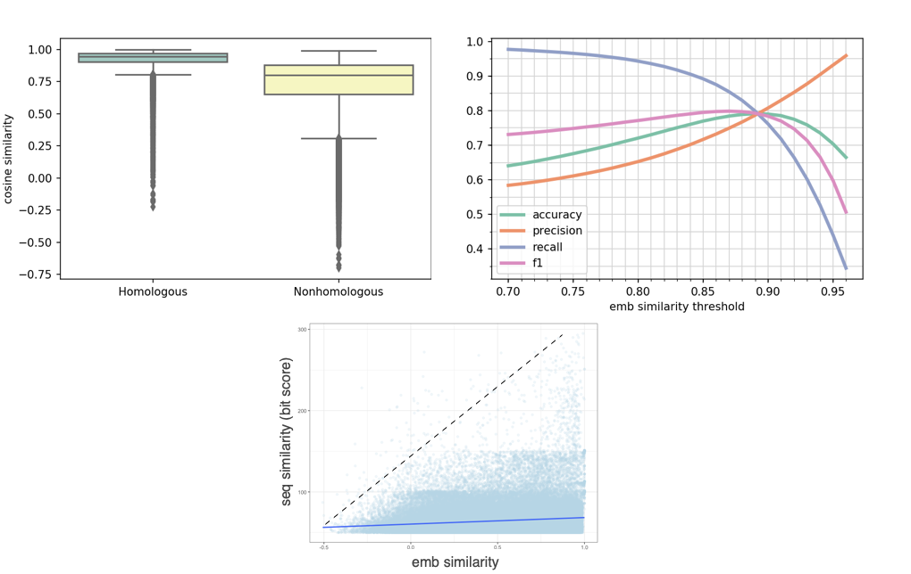
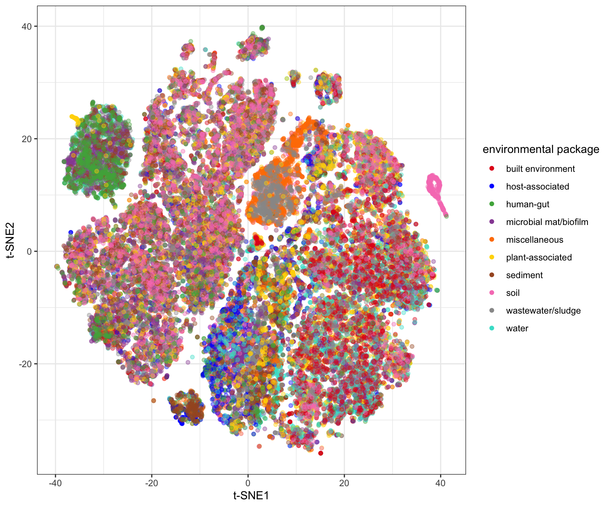
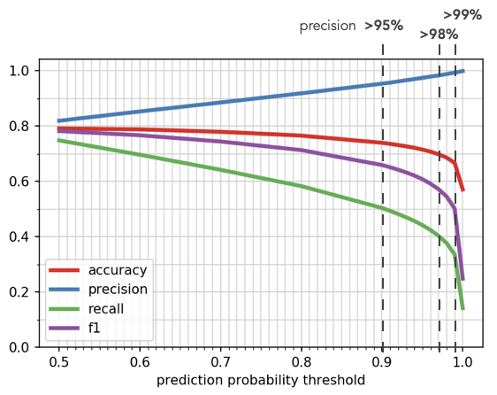

<h1 align="center">The Universal Language of Life</h1>

<h2 align="center">Leveraging Deep Transfer Learning to Model the Biogeosphere</h2>

<b><i>Adrienne Hoarfrost and Yana Bromberg</i></b>

<i>Session 06h: Q&A Wednesday 24th June 11:00 - 12:00 (HST)</i>

# Can we capture the functional features underlying the vast diversity of the microbial world with deep learning?

Microbial communities live in intricate interconnection with their environment, driving the regulation of biogeochemical cycles and the coevolution of the biosphere and geosphere. The vastness of microbial diversity can be overwhelming, and often inhibits development of accurate models of their complex functional outcomes. This is a particular shortcoming in environmental settings, from which samples of interest are relatively rare, and even more rarely are collected with corresponding geochemical data. 

## A deep transfer learning approach

* We developed **LookingGlass** - a model of the 'universal language of life' from sequences across the tree of life. This model is a 3-layer Long-Short Term Memory Network trained to predict the identity of a masked nucleotide from its DNA context. This model produces representations, or embeddings, of biological sequences that are ***functionally- and evolutionarily- relevant***.  

* From this 'universal' model, we can build more accurate models with less data for downstream modeling tasks of interest - a principle called **transfer learning**. This is ideal for environmental applications, in which samples and the corresponding label of interest are expensive and time-consuming to acquire.    

## Sequence embeddings are functionally and evolutionarily relevant

  

**Figure 1:** Similarity between model output embeddings of individual DNA reads is higher for homologous sequences than nonhomologous sequences (left, P<0.001). With no additional training, using an embedding similarity threshold alone, we can differentiate homologous from nonhomologous sequences with a maximum 80% accuracy (right).

Additionally, fine tuning the original LookingGlass model to predict functional annotations of DNA reads results in a **functional classifier with 77% accuracy**. This functional model can classify reads belonging to one of 1274 functional annotations (as predicted by the *mifaser* functional annotation tool). 

Together, the ability of LookingGlass to differentiate between functional annotation and homology among DNA sequences suggest the embeddings produced by the model are both functionally and evolutionarily relevant. Interestingly, embeddings are not correlated with overall sequence similarity (R2=0.02, bottom), so embeddings are capturing higher order functional and evolutionary features of biology rather than simply memorizing DNA sequences. This feature is particularly valuable for ancient, diverse homologous groups with low sequence similarity among homologs.

## Sequence embeddings differentiate environmental context of microbial communities

 

**Figure 2:** t-SNE visualization of the LookingGlass embedding output for DNA sequences from the ten standard environmental packages (as defined by the MIxS sequencing metadata standards); embeddings of sequences from different environmental contexts are distinct from one another (Permanova P<10-16)

## Future directions - mining metagenomes for unannotated microbial dark matter 

LookingGlass predicts function and captures homology among sequences, even when the sequence similarity between homologous sequences is low. It is thus likely that a downstream model can be fine-tuned to predict a function of interest, even if the sequence similarity among homologs is below the threshold of detection for state-of-the-art alignment tools. 

Oxidoreductases (EC number 1.-.-.-) are an ancient group of proteins that are widely distributed across the tree of life, and thus are highly divergent such that functional homologs in distant branches of the tree of life can have very low sequence similarity. Annotation of novel oxidoreductases in the environment can thus be difficult or impossible using traditional alignment tools, which cannot infer function at low sequence similarity. 

 

**We fine-tuned the LookingGlass model to identify novel oxidoreductase sequences.** This fine-tuned "EC1 classifier" can recognize oxidoreductases from functional groups not yet seen in the training set with ***80% accuracy***, suggesting the EC1 classifier is a generally useful tool for identifying oxidoreductases from environmental samples, whether or not those sequences can be annotated by traditional approaches. If a higher classification threshold is chosen, novel oxidoreductases can be identified with up to ****99%**** precision (above). Future work is focusing on applying this model to environmental metagenomes to direct gene-targeted assembly of novel oxidoreductase genes.

In a typical set of metagenomes from the DCM and mesopelagic depths in the South Pacific Gyre sampled as part of the TARA project, using a more "traditional" homology-based functional annotation tool (MIFASER), only 2% of reads can be annotated, and only 0.28-0.45% of reads are identified as oxidoreductases. Using our EC1 classifier, roughly 15-18% of sequences in the metagenome are identified as oxidoreductases (left vs right pie charts, below). A smaller but more precise subset can be identified using a higher-precision classification threshold (darker green triangles), that still exceed the capabilities of traditional functional annotation tools by 5-20x. 

 

Future directions will focus on analysis of this "microbial dark matter":
* More complete functional comparisons across environments?
* Targeted high-throughput functional characterization of ‘microbial dark matter’?
* Expand intermediate sequences for poorly resolved phylogenetic trees?

------------------------------------------
Thank you to all the members of the ENIGMA NASA Astrobiology Institute and the Bromberg lab at Rutgers. 
And to our funding sources:

 

