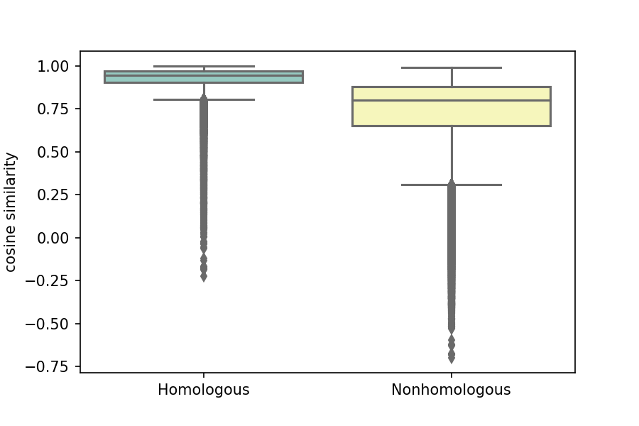
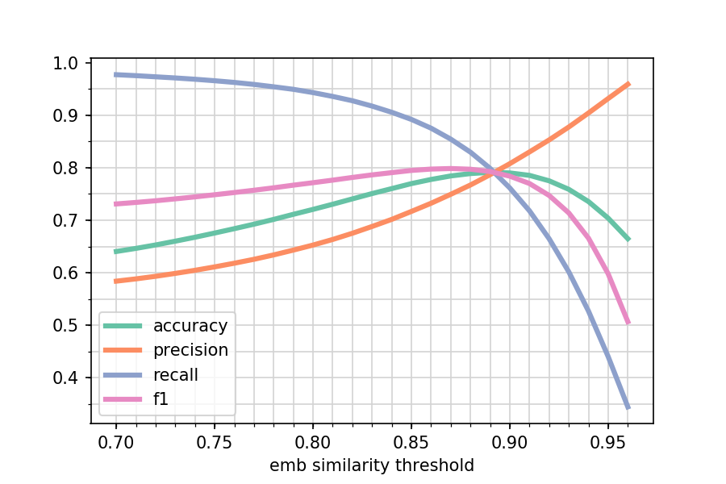
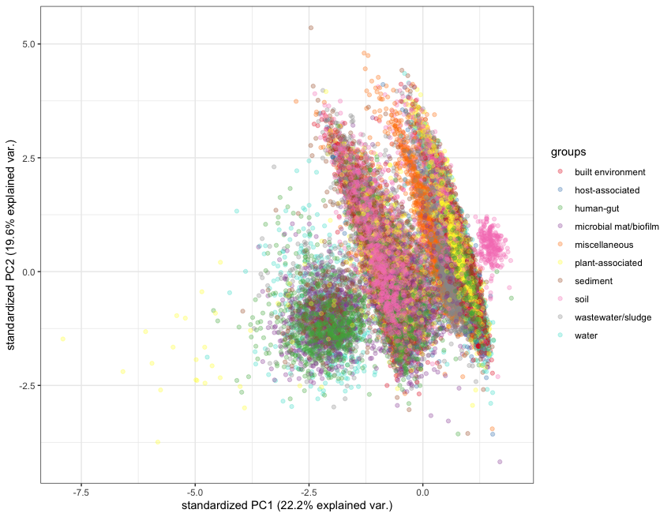

<h1 align="center">The Universal Language of Life</h1>

<h2 align="center">Leveraging Deep Transfer Learning to Model the Biogeosphere</h2>

<b><i>Adrienne Hoarfrost and Yana Bromberg</i></b>

<i>Session 06h: Q&A Wednesday 24th June 11:00 - 12:00 (HST)</i>

# Can we capture the functional features underlying the vast diversity of the microbial world with deep learning?

Microbial communities live in intricate interconnection with their environment, driving the regulation of biogeochemical cycles and the coevolution of the biosphere and geosphere. The vastness of microbial diversity can be overwhelming, and often inhibits development of accurate models of their complex functional outcomes. This is a particular shortcoming in environmental settings, from which samples of interest are relatively rare, and even more rarely are collected with corresponding geochemical data. 

## A deep transfer learning approach

* We developed **LookingGlass** - a model of the 'universal language of life' from sequences across the tree of life. This model produces representations, or embeddings, of biological sequences that are ***functionally- and evolutionarily- relevant***.  

* From this 'universal' model, we can build more accurate models with less data for downstream modeling tasks of interest - a principle called **transfer learning**. This is ideal for environmental applications, in which samples and the corresponding label of interest are expensive and time-consuming to acquire.    

## Sequence embeddings are functionally and evolutionarily relevant

  
   

**Figure 1:** Similarity between model output embeddings of individual DNA reads is higher for homologous sequences than nonhomologous sequences (left, P<0.001). With no additional training, using an embedding similarity threshold alone, we can differentiate homologous from nonhomologous sequences with a maximum 80% accuracy (right).

Additionally, fine tuning the original LookingGlass model to predict functional annotations of DNA reads results in a **functional classifier with 78% accuracy**. This functional model can classify reads belonging to one of 1274 functional annotations (as predicted by the *mifaser* functional annotation tool). 

## Sequence embeddings differentiate environmental context of microbial communities

 

**Figure 2:** PCA visualization of the LookingGlass embedding output for DNA sequences from the ten standard environmental packages (as defined by the MIxS sequencing metadata standards); embeddings of sequences from different environmental contexts are distinct from one another (Permanova P<10e-16)
